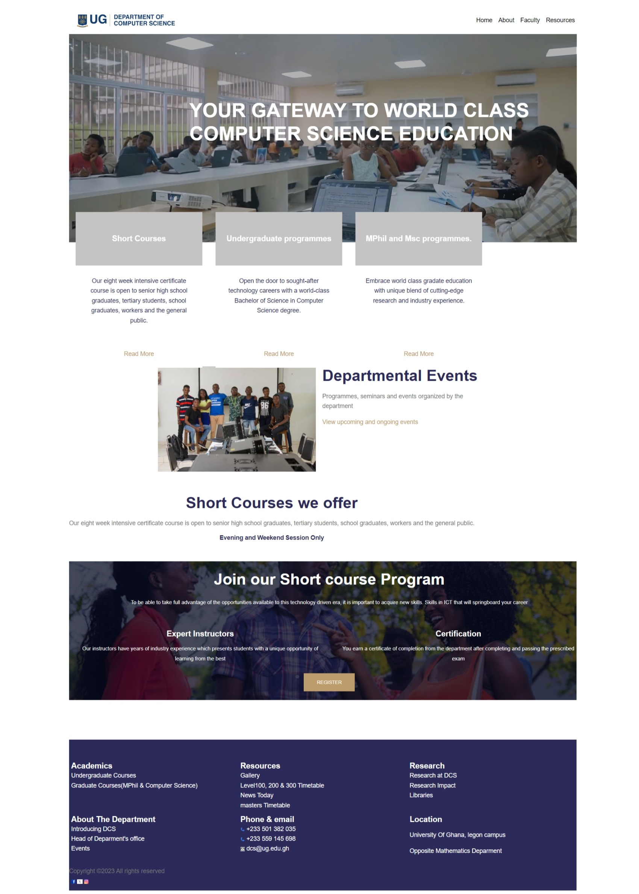
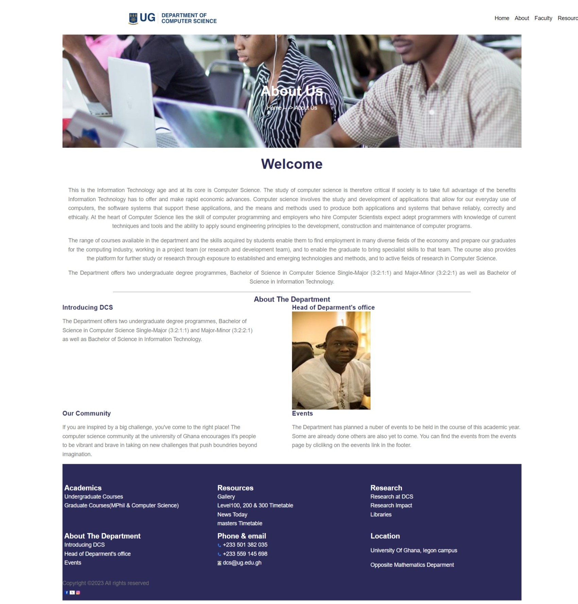
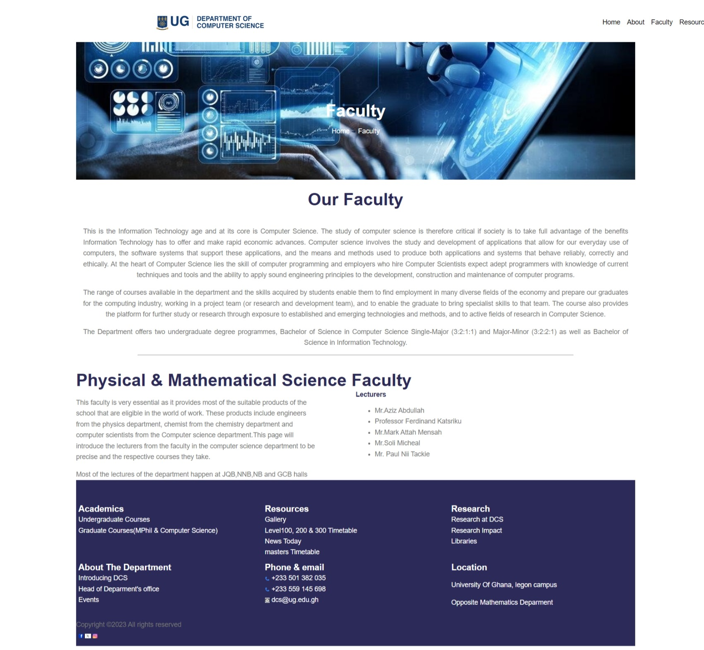
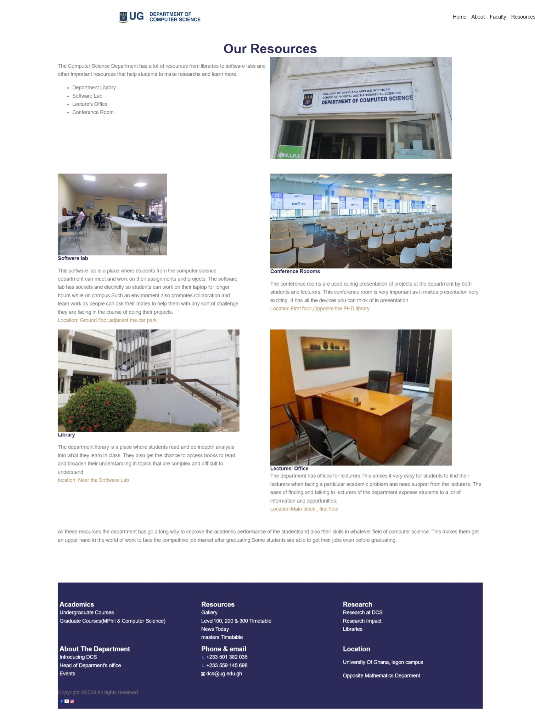
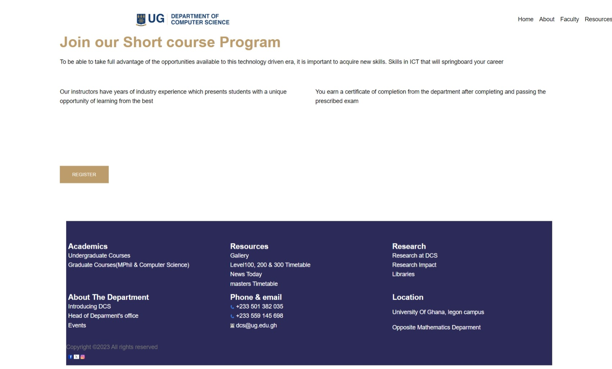
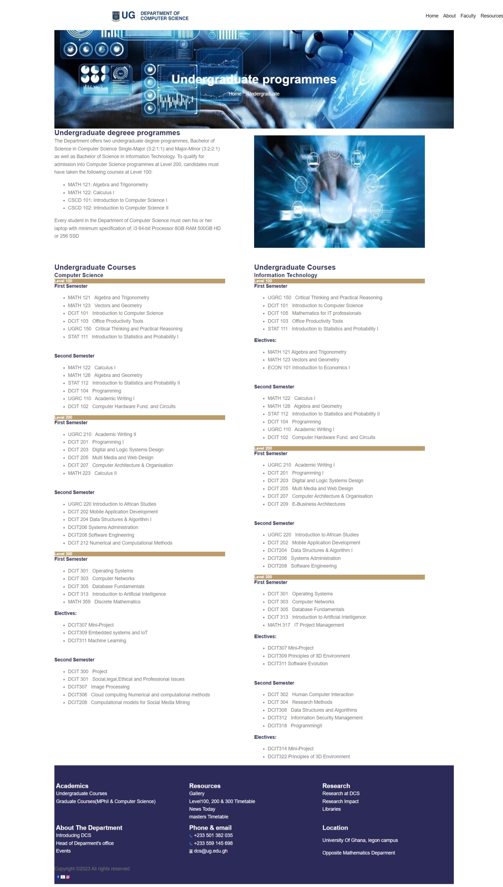
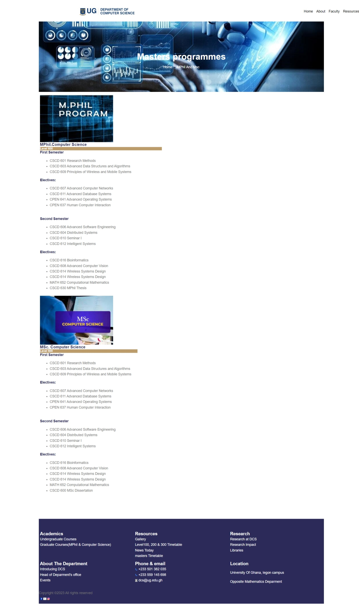
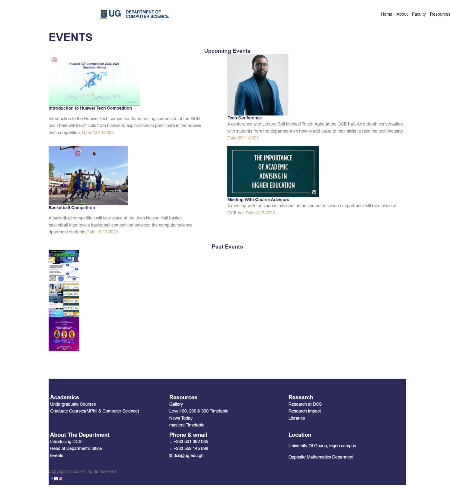
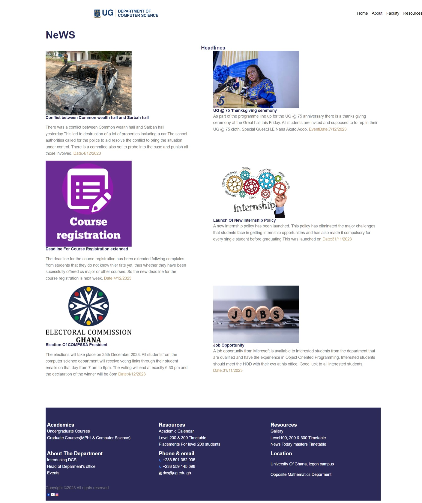

# DCIT_205_IA

# Introduction 
The website is for  an educational institution.It has 10 pages, each page has its own information and functionality to the general purpose of the website.The pages of the website include;the homepage,about page, faculty page,resources page,shortcourses page,undergraduate page, masters page, events page, gallery page and News page.
The homepage has all links to the other nine pages and all the other nine pages are linked together.The homepage provides information to the public on what the website is for.Some of the things the homepage presents to the public is the ability to acess the information concerning the educational institution.This information includes the various levels of education the department offers thus short courses, undergraduate courses and masters courses.All the pages have a header that has a logo of the department and a horizontal navigation bar.They also have  a footer that has all links to the various pages of the website.The events page shows the upcoming and past events, the about page has information about the department, the faculty page has information about the various lectures in the department,the resources page have information concerning the various infrasture, facilities and opportunuties that members of the department are entitled to inluding both staff and students.The undergraduate and masters page has information on the varous courses students will take through out the programme and other important information.
The general purpose of the website is to provide information to students of our department and the general public on possible admission into any programme offered by the department.The website has some inline styles for some elements and an external style in home.css,events.css and about.css.

#Detailed instructions on how to clone and set up the project
First, I forked the original repository in the instructions  to get a copy of it and used git bash to clone it .I cloned it by using git bash in this manner; I typed git clone and copied the SSH link from git hub  and pasted it on git bash and pressed enter this created  the  folder on my desktop and I opened it with Visual studio Code to start working on it.
# Author
Id:11255826   Name:Akoto Boadi
# Screenshots of each page of my website

#lesson learned
I have learnt a lot of new things since I started this assignment last week, some of the things I have learnt so far are;
1.The meta tags and thier importance in the html 
The Meta tags are HTML tags that provide information about a webpage’s content to search engines and users.
Meta tags are  added in the <head> section of your HTML. 
The meta description tag provides a short description of the page.It is he description shown in sarch results.
The meta viewport tag controls how the webpage is displayed on mobile devices.
e.g is shown below;
<meta name="viewport" content="width=device-width, initial-scale=1.0">
There are other useful meta tags.

2.I have alsolearnt about how the display flex property is used in div elements to produce the output you are looking for.
I have been exposed to the various properties that can be attributed to a flex element in css
This includes the flex wrap that indicates whether there should be a wrap when space is too small
Another property is the flex direction  which can either be coumn or row, and column reverse or row reverse.
The flex grow, flex shrink property also  indicatrs hoe the flex element should expand and shrink respectively depending
screen width.
3. I have also learnt a little bit of responsive design such that the design of some elements f the website changes when there is a reduced screen width.
In my website there is a responsive design feature that makes the footer background color change when the website is opened on screen sizes
less than a maximum and certain features removed . This is very nice as responsive design creates a suitable design for different media.

